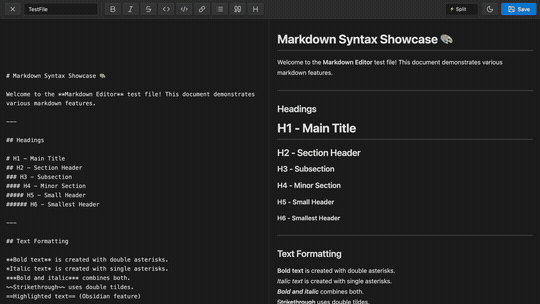

  
  
  <h1 align="center">MARKDOWN EDITOR</h1>
  <h3 align="center"> Tʜᴇ Mᴀʀᴋᴅᴏᴡɴ Eᴅɪᴛɪɴɢ Cᴏɴᴛᴀɪɴᴇʀ </h3>

  <!-- TOP PURPLE LINKS -->
  
  
  
   
  <!-- BOTTOM GOLD TAXONOMY -->
  
  
  
  

  
<em>A standardized, split-pane markdown editing experience with live rendering, custom Obsidian syntax parsing, and robust file saving.</em>

## Overview

Markdown Editor is a utility component that provides a full-featured, side-by-side raw markdown editor and an interactive previewer. It replicates Obsidian's native formatting capabilities within a single workspace leaf. All edits are saved directly back to the specified markdown source file, enabling inline note compilation and modification workflows.

## Features

### Runtime and Agentic Safety
Integrates an active file-system watch daemon (`data/mcp_commands.json`) that polls reload commands to execute HMR layout updates. Features full-pane reparenting to Obsidian leaf content with dynamic stylesheet injection to hide workspace footer pollution.

### Security and Integrations
Operates completely sandbox-compliant with isolated local storage bindings, bypassing external APIs. Includes custom markdown token extensions that map wikilinks, callouts, and PDF views securely within Obsidian namespaces.

### User Interface and Developer Loop
Offers a split-screen view mode linking text editor inputs to HTML rendering outputs. Features an in-client formatting toolbar, standard theme compatibility variables, and a quick file loading selector.

## Directory Index

The package exposes the following compiled files:

| File | Description |
| :--- | :--- |
| **[MARKDOWN EDITOR.md](MARKDOWN%20EDITOR.md)** | The main entry point designed to be loaded inside Obsidian workspace leaves. |
| **[_RESOURCES/DATACORE/_DONE/MARKDOWN EDITOR/src/index.jsx](_RESOURCES/DATACORE/_DONE/MARKDOWN%20EDITOR/src/index.jsx)** | Main bootstrapper and loader hook that handles namespaces and builds the view. |
| **[_RESOURCES/DATACORE/_DONE/MARKDOWN EDITOR/src/App.jsx](_RESOURCES/DATACORE/_DONE/MARKDOWN%20EDITOR/src/App.jsx)** | Main coordinator component containing editor states, rendering, and logic. |
| **[METADATA.md](_RESOURCES/DATACORE/_DONE/MARKDOWN%20EDITOR/METADATA.md)** | Packaging manifest outlining indexing, target, and security configurations. |
| **[CONTRIBUTION.md](_RESOURCES/DATACORE/_DONE/MARKDOWN%20EDITOR/CONTRIBUTION.md)** | Contributor architecture standards and local compilation guidelines. |
| **[LICENSE.md](_RESOURCES/DATACORE/_DONE/MARKDOWN%20EDITOR/LICENSE.md)** | MIT open-source license. |

## Contributors

- beto.group
